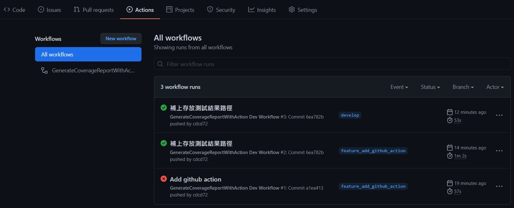
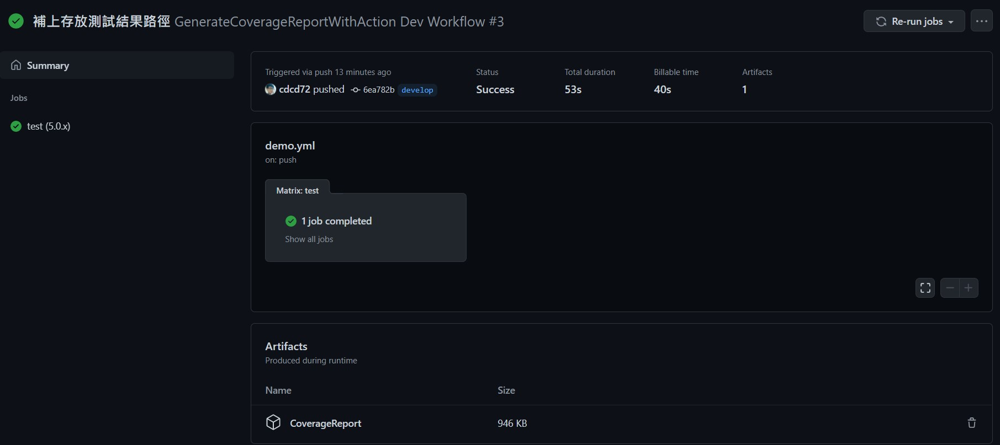

# GenerateCoverageReportWithAction.CSharp.Demo

練習實作 Github Action 並產生程式碼涵蓋率報告。  
To practice generate code coverage report with github action.

## 說明

> 當你推送 develop 或 feature\_\* 分支後會觸發其開發工作流程。

1. When you push develop or feature\_\* branch, it will trigger dev workflow.

> 接著到 Actions 頁面，可以看到那些工作流程狀況。

2. Then go to Actions page, you will see all dev workflow situation.
    > 

> 接著再點進去已跑完的工作流程，就能下載測試涵蓋率報告。

3. Then deep into completed dev workflow page, you can download code coverage report.
    > 

## 最後版本

1.0.0.0 (July 22, 2021)

## 記錄

-   1.0.0.0
    -   Initial Commit (初次上版)
